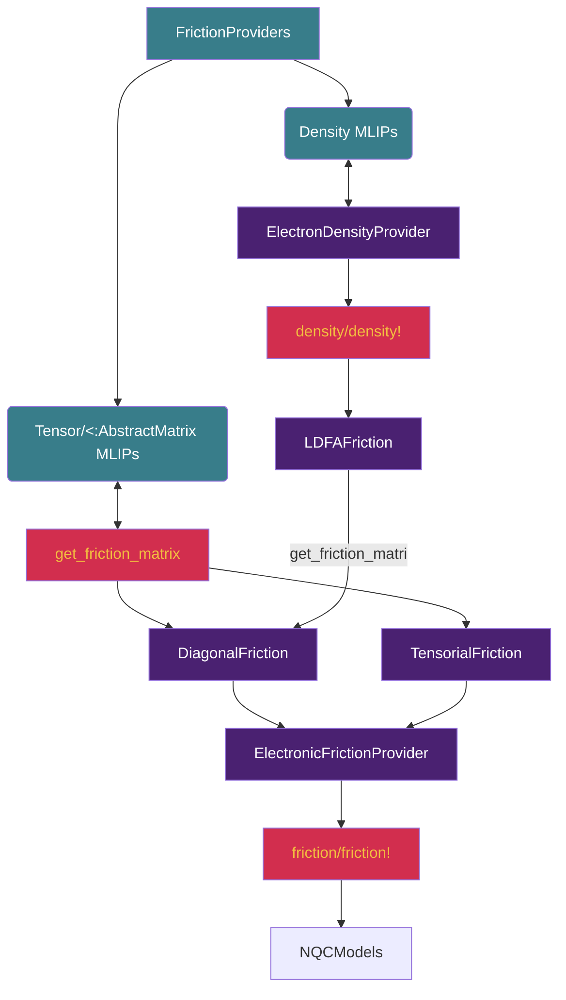

```@setup logging
@info "Expanding src/NQCModels/frictionmodels.md..."
start_time = time()
```
# [Electronic friction models](@id models-friction)
To perform [molecular dynamics with electronic friction (MDEF)](@ref mdef-dynamics)
with a specific type of model must be used
that provides the friction tensor used to propagate the dynamics. 
For this, we recommend using [FrictionProviders.jl](https://github.com/NQCD/FrictionProviders.jl), however, various analytic models can also be employed.

As described on the [MDEF page](@ref mdef-dynamics), we consider two ways to obtain friction
values, either from the local density friction approximation (LDFA), or from time-dependent
perturbation theory (TDPT), also known as orbital-dependent friction (ODF).

An overview of the functionality implemented in [FrictionProviders.jl](https://github.com/NQCD/FrictionProviders.jl) and [NQCModels.jl](@ref) is provided below:



## [NQCModels.FrictionModels](@ref)

NQCModels.jl contains the basic type definitions for friction models designed to be paired with Classical and Quantum models. 

### Classical friction models

Every Classical friction model should be a subtype of [`FrictionModels.ElectronicFrictionProvider`](@ref), which describes anything that can fill a `n_atoms * n_dofs` square matrix with an electronic friction tensor. 

As LDFA models are only expected to fill the diagonals of the electronic friction tensor, LDFA models can be a `DiagonalFriction` type, which enables the integration algorithms used by a `DynamicsMethod` to dispatch
a `Diagonal` matrix type for greater computational efficiency. 


### [Density models for LDFA](@id models-ldfa)

Our Cube-LDFA implementation takes a `.cube` file containing the electron density, whereas the ML-LDFA models predict the density directly.
In both cases the obtained local density is then used to evaluate the friction.

The model works by fitting the LDA data provided by [Gerrits2020](@cite) that provides
the LDFA friction coefficient as a function of the Wigner-Seitz radius.
When the model is initialised, the LDA data from [Gerrits2020](@cite) is interpolated
using [DataInterpolations.jl](https://github.com/PumasAI/DataInterpolations.jl)
with a cubic spline.
Then, whenever required, the density at the current position is taken directly from the
`.cube` file and converted to the Wigner-Seitz radius with the following relation:
```math
r_s(\rho) = (\frac{3}{4\pi \rho (\mathbf{r_{i}})})^{1/3}.
```
Then, the interpolation function is evaluated with this value for the radius, which gives
the LDA friction.
Optimally, this would be done via an *ab initio* calculation to get the electron density,
but this model instead uses a pre-computed `.cube` file to get the density with minimal cost.
This makes the assumption that the density does not change throughout the dynamics, or that
the surface is assumed to be frozen in place.

This graph shows how we interpolate the LDA data and evaluate the friction coefficient
as a function of the Wigner-Seitz radius.


### Tensorial Friction models

If a friction model is a subtype of [`FrictionModels.TensorialFriction`](@ref), it should provide a full-rank friction matrix with a `get_friction_matrix` function. 
NQCModels contains `ConstantFriction` and `RandomFriction` models which do this. 

### Quantum Friction models

Since *ab initio* friction calculations are often expensive it is useful to
have some models that we can use to test different friction methods.
The [`QuantumFrictionModel`](@ref QuantumModels.QuantumFrictionModel)
is the abstract type that groups together the quantum models for which electronic friction can be evaluated.
These have an explicit electronic bath, modelling the electronic structure characteristic of a metal. 
The friction is calculated for these models directly from the nonadiabatic couplings
with the equation:
```math
γ = 2\pi\hbar \sum_j \braket{1|dH|j}\braket{j|dH|1} \delta(\omega_j) / \omega_j
```
where the delta function is approximated by a normalised Gaussian function and the sum
runs over the adiabatic states ([Box2021, Box2023](@cite)).
The matrix elements in this equation are the position derivatives of the diabatic hamiltonian
converted to the adiabatic representation.

!!! warning

    The analytic friction models and the equation above are experimental and subject to change.

## [FrictionProviders.jl](@id friction-providers)

[`FrictionProviders.jl`](https://github.com/NQCD/FrictionProviders.jl) contains interfaces to machine learning interatomic potentials which predict electronic friction, both for LDFA and ODF. 

Currently, [FrictionProviders.jl](https://github.com/NQCD/FrictionProviders.jl) supports
LDFA (density) models based on:
- Cube electronic densities
- [ACEpotentials.jl](https://github.com/ACEsuit/ACEpotentials.jl)
- [Scikit-learn](https://github.com/scikit-learn/scikit-learn)

TDPT (ODF) friction models based on:
- [ACEds.jl](https://github.com/ACEsuit/ACEds.jl)
- [ACEfriction.jl](https://github.com/ACEsuit/ACEfriction.jl)

The use of [FrictionProviders.jl](https://github.com/NQCD/FrictionProviders.jl) with LDFA (Cube calculator and ACE model), and TDPT (ACEds-based model) is explained on the [reactive scattering example](@ref example-h2scattering), to investigate the scattering of a diatomic molecule from a metal surface.
