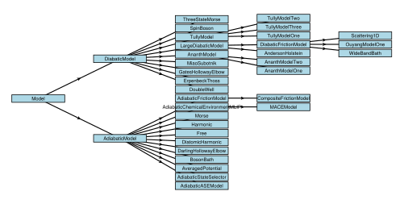

```@setup logging
@info "Expanding src/NQCModels/overview.md..."
start_time = time()
```

# NQCModels.jl

!!! details "Overview of all model types currently implemented."

    ```@raw html
    
    ```

To perform nonadiabatic molecular dynamics simulations, it is necessary to define
the system Hamiltonian.
For simple models, this often comes in the form of small matrix in the diabatic
representation but equally the electronic Hamiltonian could be obtained directly
from _ab initio_ electronic structure theory.

`NQCModels.jl` is a package that aims to provide a common interface
for defining these models that is flexible enough to allow for a wide range
of specifications and requirements.
`NQCDynamics.jl` uses this interface to obtain the potentials
and couplings necessary to perform the dynamics simulations.
Along with the minimal interface, `NQCModels.jl` also provides a library of 
popular models often used in the field of nonadiabatic dynamics.

!!! note

    Taking advantages of Julia's seamless modularity, `NQCModels.jl` is designed
    as a separate package so that it can also be used independently from the main package.

Depending on the quantities provided by the `Model`, we use Julia's abstract type system
to group models that provide the same quantities.
Currently, there are two top-level abstract types: [`ClassicalModel`](@ref ClassicalModels.ClassicalModel)
and [`QuantumModel`](@ref QuantumModels.QuantumModel).
The [`ClassicalModel`](@ref ClassicalModels.ClassicalModel)
is used for adiabatic dynamics, providing only a classical potential in 
the form of an analytical function and its derivative, the force used in 
classical mechanics.
The [`QuantumModel`](@ref QuantumModels.QuantumModel) is used for nonadiabatic dynamics,
where the potential is no longer an analytical function instead a `Hermitian` matrix.

## Using `Model`s

In the [Getting started](@ref) section we briefly touched on how the
[`ClassicalModel`](@ref ClassicalModels.ClassicalModel)
works and introduced one of the included models.
Here let's take a look at a [`QuantumModel`](@ref QuantumModels.QuantumModel),
which is more appropriate for nonadiabatic dynamics.

The [`DoubleWell`](@ref) is a two state, 1 dimensional model where each state is harmonic
with linear coupling to the single degree of freedom.

```@example diabaticmodel
using NQCModels

model = DoubleWell()
```

Our [`DoubleWell`](@ref) implements the functions [`potential`](@ref) and [`derivative`](@ref), 
their in-place versions, [`nstates`](@ref) and [`ndofs`](@ref)
that return the potential, the derivative of the potential, the number of states,
and the number of degrees of freedom, respectively.

```@repl diabaticmodel
p = potential(model, hcat(0.2))
d = derivative(model, hcat(0.2))

potential!(model, p, hcat(0.5))
derivative!(model, d, hcat(0.5))

nstates(model)
ndofs(model)
```

In general the position argument that appears in the derivative and the potential
will need to be provided as an `AbstractMatrix` with dimensions `dofs`x`natoms`.
In the case of 1D models of a single atom, `potential` and `derivative` accept a 
position of type `Real`, but for the most consistent results it's recommended that 
the user wraps real valued positions in 1x1 matrices using the `hcat` function.

To understand how this can extend to another dimension, we can take a quick look at the
[`GatesHollowayElbow`](@ref) model which is another two state diabatic model, but this
one uses two dimensions to model a diatomic molecule interacting with a surface.
The two degrees of freedom are the molecular bond length and the distance from the surface 
respectively and so the `potential` and `derivative` functions accept a position argument 
with two values, one for each degree of freedom.

```@repl diabaticmodel
model = GatesHollowayElbow()
p = potential(model, [1.0 1.0])
d = derivative(model, [1.0 1.0])

potential!(model, p, [1.2 0.5])
derivative!(model, d, [1.2 0.5])

nstates(model)
ndofs(model)
```

Here we see how the derivative now becomes a `Matrix` with size matching our input,
but each entry is a `Hermitian` containing the elementwise derivative of the potential
with respect to each degree of freedom.
In this case, the `Matrix` has `size = (1, 2)`, and in general the dimensions of the `Matrix`
that wraps the `Hermitian` derivatives should match the dimensions of the position `Matrix`
a given model takes as input.

## Included models

`NQCModels.jl` includes both analytical models as well as interfaces to connect to full-dimensional potential energy surfaces.
An overview of the implemented analytical models can be seen in the [Analytic model library](@ref) and
many shall return later when we investigate the dynamics methods.
An overview of interfaces to full-dimensional potential energy surfaces can be seen in the [Full dimensional model library](@ref).

!!! note "Contributing new models"

    To learn more about NQCModels.jl and learn how to implement new models,
    visit the [developer documentation](@ref devdocs-model).

```@setup logging
runtime = round(time() - start_time; digits=2)
@info "...done after $runtime s."
```
