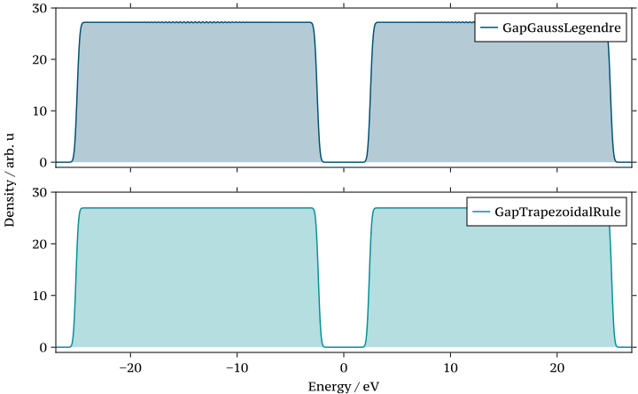

```@setup logging
@info "Expanding src/NQCModels/systembathmodels.md..."
start_time = time()
```

# System-bath models
This documentation is a collaborative work jointly authored by [Xuexun Lu (Hok-seon)](https://louhokseson.github.io), [Matt Larkin](https://uk.linkedin.com/in/matthew-larkin-773307219) and [Nils Hertl](https://scholar.google.com/citations?user=I65S8ZQAAAAJ&hl=en).

## Introduction

Often, in chemical dynamics, we consider "open systems", i.e. systems that are coupled to an environment (or "bath"). For example, we can consider a molecule in contact with a metal or semiconductor surface as a molecule in contact with an electron bath (the surface electrons) and a phonon bath (the surface vibrations). Quantum Hamiltonian models that describe system-bath coupling allow the simulation of energy exchange and dissipation between the system and the bath(s).

The effect that the bath has on the system is described by the bath spectral density, ``J(\varepsilon)``, which can take various forms depending on the choice of coupling.

```@setup intro
using NQCDynamics
```

## Spin-Boson model
The Spin-Boson model consists of 2 electronic states (2-level system) coupled to a bath of harmonic oscillators. The potential of the system is given below.
```math
V(\mathbf{\hat{R}}) = 
\begin{pmatrix}
\varepsilon + \mathbf{c}^{T} \mathbf{\hat{R}} & \Delta\\
\Delta & - \varepsilon - \mathbf{c}^{T} \mathbf{\hat{R}}
\end{pmatrix} + \frac{1}{2} \mathbf{\hat{R}}^{T} \mathbf{\Omega}^{2} \mathbf{\hat{R}} 
```
The set of coupling coefficients (``\mathbf{c} = \{c\}``) and frequencies (``\mathbf{\Omega} = \{\omega\}``) of the bath harmonic modes required for this model are sampled from a discretisation of the bath spectral density, ``J(\omega)``.

When defining the Spin-Boson model, 4 arguments are provided to the function:
```julia
using NQCModels
SpinBoson(density::SpectralDensity, N::Integer, ϵ, Δ)
```
The first two arguments define the bath discretisation, the first being the type of bath, the second (`N`) indicates the number of discretised bath modes. From these arguments, the bath discretisation functions can return the set of frequencies, ``\Omega``, and coupling coefficients for each harmonic mode ``j``.

The final two arguments `ϵ` and `Δ` define information about the 2-level system coupling to the bath. `ϵ` provides the energy bias between the two states and `Δ` the coupling between them (also referred to as the tunneling matrix element) [He2019](@cite).

Discretisations of the spectral density function have been implemented for two of the bath types that are commonly used in literature.
 - **Ohmic** bath (`OhmicSpectralDensity()`)
 - **Debye** bath (`DebyeSpectralDensity()`, `AltDebyeSpectralDensity`)

These functions are containers that store the relevant information needed to build a discretised bath. The actual construction and subsequent sampling is only done when `SpinBoson()` is called.

The following section details each bath discretisation method with examples of their implementation.

### Ohmic bath

The Ohmic bath spectral density function (for ``\omega \geq 0``) takes the form:
```math
J(\omega) = \frac{\pi}{2} \alpha \omega e^{-\omega / \omega_{c}}  
```
Where ``\omega_{c}`` is the characteristic frequency of the bath and ``\alpha`` is the Kondo parameter. These are provided as inputs to the function `OhmicSpectralDensity(ωᶜ,α)`.

The set of frequencies, ``\mathbf{\Omega}``, and coupling coefficients, ``\mathbf{c}``, are generated for the number of discretised bath modes, ``N_{b}`` provided.
```math
\begin{align*}
   \omega_{j} &= - \omega_{c} \ln\left[ 1 - \frac{j}{(1 + N_{b})} \right] \\
   c_{j} &= \sqrt{\frac{\alpha \omega_{c}}{N_{b} + 1}} \omega_{j}
\end{align*}
```

Where ``j=1,...,N_{b}``.

**Example**

```@repl spinboson-debyebath
using NQCModels
DebyeDensity = DebyeSpectralDensity(0.25, 0.5)
SpinBoson(DebyeDensity, 10, 1.0, 1.0)
```

### Debye bath
The Debye bath spectral density function takes the form:
```math
J(\omega) = 2 \lambda \frac{\omega_{c} \omega}{\omega_{c}^{2} + \omega^{2}} 
```
Where ``\omega_{c}`` is the characteristic frequency of the bath and ``\lambda`` is the reorganisation. These are provided as inputs to the function `DebyeSpectralDensity(ωᶜ,λ)`.

The set of frequencies, ``\mathbf{\Omega}``, and coupling coefficients, ``\mathbf{c}``, are generated for the number of discretised bath modes, ``N_{b}`` provided.
```math
\begin{align*}
   \omega_{j} &= \omega_{c} \tan\left( \frac{\pi}{2} \left(1 - \frac{j}{(1 + N_{b})} \right) \right) \\
   c_{j} &= \sqrt{\frac{2 \lambda}{N_{b} + 1}} \omega_{j}
\end{align*}
```

Where ``j=1,...,N_{b}``.

**Example**

```@repl spinboson-ohmicbath
using NQCModels
OhmicDensity = OhmicSpectralDensity(2.5, 0.1)
SpinBoson(OhmicDensity, 10, 1.0, 1.0)
```

## Newns-Anderson model
The Anderson Impurity Model (AIM) describes a single electronic state ("impurity") coupled with a continuous band of electronic bath states. AIM is a fundamental model in condensed matter physics and quantum chemistry, introduced by P.W. Anderson in 1961. The Newns-Anderson model is a generalization of the AIM, which includes the possibility of multiple impurity states and a more complex interaction with the bath. A key advantage of using the AIM lies in its ability to yield analytical solutions for the energy level distribution and the hybridization (coupling) density, making it a powerful tool for theoretical analysis.
### Theory
The total Hamiltonian ``H`` of the Newns-Anderson model can be written as:

```math
H = H_{S} + H_{B} + H_{C}
```

#### Impurity

The Impurity (or system, S) Hamiltonian describes the localized orbitals:

```math
H_{S} = \sum_{i} \varepsilon_{i} d_{i}^{\dagger} d_{i}
```

Here
* ``\varepsilon_{i}`` is the energy of the ``i``-th impurity orbital.
* ``d_i^{\dagger}, d_i`` : creation/annihilation operators for orbital ``i``

For the specific case of a single impurity system, the system Hamiltonian can be expressed as:

```math
H_{S} = h \cdot d^{\dagger} d + U_0
```

In this representation:
* ``U_0`` is a state-independent potential (or energy offset)
* ``h`` is the energy contribution due to populating the impurity state. It can be convenient to define ``h = U_1 - U_0`` such that ``U_1`` and ``U_0`` define two energy landscapes and populating ``h`` with an electron switches between ``U_0`` and ``U_1``

#### Bath 
Describes a set of non-interacting electronic states. Usually written as
```math
H_B = \sum_{k} \epsilon_k c_k^{\dagger} c_k
```

- ``\epsilon_k``: energy of bath state ``k``  
- ``c_{k}^\dagger, c_{k}``: creation/annihilation operators for state ``k``

#### Interaction

Captures the coupling between the impurity, ``i``, and the bath states, ``k``:
```math
H_{C} = \sum_{i,k} V_{ik} d_i^{\dagger} c_k + V_{ik}^{*} c_k^{\dagger} d_i
```

where ``V_{ik}`` stands for the coupling strength.

### Example
To build a Newns-Anderson model in NQCModels.jl, you can use the [`AndersonHolstein`](@ref):
```@repl namodel
using NQCModels
quantum_model = ErpenbeckThoss(Γ=2.0)
bath = TrapezoidalRule(10, -1, 1)
AndersonHolstein(quantum_model, bath; couplings_rescale=1.0)
```
The `ErpenbeckThoss` model ([Erpenbeck2018](@cite), [Erpenbeck2019](@cite)) is used here to describe the adsorbate impurity (the system Hamiltonian ``H_S``) and a `TrapezoidalRule` discretisation scheme provides the set of discrete energy states (and their couplings to the impurity) that represent the bath of electrons in a metal surface. The [`couplings_rescale`](@ref AndersonHolstein) is a scalar parameter that rescales the coupling strengths to the bath states to adjust the model's parametrisation to the chosen discretisation. Let's now look at the various ways to discretise the electron bath.


### Discretisation of bath 
Some mixed quantum classical dynamics methods that deal with system-bath simulations require the discretisation of the bath spectral density, ``J(\varepsilon)``, into a finite number of discrete energy levels such that the individual state couplings are explicitly considered during propagation. i.e. [Independent electron surface hopping (IESH)](@ref) [Shenvi2009](@cite) [Gardner2023](@cite).

The bath spectral density here is given by the following integral:
```math
J(\varepsilon) = \int_{a}^{b} d\varepsilon' \left| V(\varepsilon') \right|^{2} \delta(\varepsilon - \varepsilon') = \left| V(\varepsilon) \right|^{2}
```
Where ``V(\varepsilon)`` is the "coupling function" which describes how the bath and system should be related at a given energy [DeVega2015](@cite)].
Discretising this over a set of $N$ bath states gives the following form:
```math
J^{discr}(\varepsilon) = \sum_{n=1}^{N} \left|V_{n}\right|^{2} \delta \left( \varepsilon - \varepsilon_{n} \right)
```
Where ``V_{n}`` is the coupling contribution at state n. 
 
#### Discretisation in the wide band limit
The Wide Band Limit (WBL) is a common approximation which considers the bath spectral density to be constant over a wide range of energies.
In the WBL, discretisation of the bath spectral density function, ``J(\varepsilon)``, yields couplings associated with each state that are simply related to the energy spacing between states.

##### WBL Discretisation with constant spacing
The simplest choice for discretising the bath spectral density is to represent the bath as a set of `M` evenly spaced energy states according to a trapezoidal integration rule. 

This is implemented as `TrapezoidalRule()` which takes the following arguments:
```julia
using NQCModels
TrapezoidalRule(M, bandmin, bandmax)
```
Where:
 - `M` = number of discretised bath states to be generated
 - `bandmin` / `bandmax` = miniumum / maximum energies that define the bath energy range

The discretised bath energy states, ``\varepsilon_{n}``, and couplings, ``V_{n}``, are calculated as follows:
```math
\begin{align*}
   \varepsilon_{n} &= a + \frac{(n - 1)(b - a)}{M - 1} \\
   V_{n} &= V(\varepsilon_{n})\sqrt{(b-a)/(M-1)} = \sqrt{\Delta \varepsilon_{n}}
\end{align*}
```
Where:
 - ``n`` = index of the discretised state
 - ``a`` = minimum energy of bath discretisation (`bandmin`)
 - ``b`` = maximum energy of bath discretisation (`bandmax`)
 - ``M`` = number of bath states in the discretisation (`M`)
 - ``\Delta \varepsilon_{n}`` is the spacing between the ``n`` discretised energy states 
 - ``V(\varepsilon_{n})`` is the coupling function evaluated at the ``n`` discretised energy states

When making the WBL approximation, however, the coupling function, ``V(\varepsilon)``, is independent of energy, ``\varepsilon``. Taking ``V(\varepsilon_{n})`` as a  constant allows the simplification:
```math
\left| V_{n} \right|^{2} = \left| V(\varepsilon_{n}) \right|^{2} \Delta \varepsilon_{n} \approx \Delta \varepsilon_{n}
```

This discretisation method is effective and given enough states will always accurately represent the spectral density, but methods such as IESH using this discretisation scheme will suffer from long computation times as the number of bath states ``M`` increases. 

!!! tip "Number of bath states"
      Typically, keeping ``M<100`` for IESH simulations is highly recommended to keep computational simulation times low.

##### WBL Discretisation by Gauss-Legendre quadrature
Gauss-Legendre quadrature addresses the computational scaling issues with constant spacing methods and allows denser sampling close to the midpoint of the electronic band (the Fermi energy). In the Gauss-Legendre quadrature, the discretised levels and couplings have different meaning:
 - energy states (``\varepsilon_{n}``) ``\leftarrow`` rescaled knots (``\epsilon_{n}``)
 - coupling elements (``V_{n}``) ``\leftarrow`` rescaled weights (``\tilde{w}_{n}``) 


!!! note 
      The rescaled weights, ``\tilde{w}_{n}``, fill the role of ``\Delta \varepsilon_{n}`` as described above for the Trapezoidal Rule discretisation. 
      
      ``\left| V_{n} \right|^{2} = \left| V(\epsilon_{n}) \right|^{2} \tilde{w}_{n} \approx \tilde{w}_{n}``

Implemented as `ShenviGaussLegendre()` is the method developed by Shenvi et al in 2009, where Gauss-Legendre quadrature was used to discretise the bath in two halves, one above and one below the Fermi level [Shenvi2009](@cite). 
This function takes the following arguments:
```julia
using NQCModels
ShenviGaussLegendre(M, bandmin, bandmax)
```

The rescaled knots, ``\epsilon_{n}``, and weights, ``w_{n}``, are given by the following scaling related to the value of the Fermi level, ``\epsilon_{n}``.
```math
\begin{align*}
   \epsilon_{n} &=
   \begin{cases}
      \frac{1}{2}(\epsilon_{f} - a) x_{n} + \frac{1}{2}(a + \epsilon_{f}) \qquad n \leq M/2\\
      \frac{1}{2}(b - \epsilon_{f}) x_{n} + \frac{1}{2}(\epsilon_{f} - b) \qquad n \geq M/2
   \end{cases}\\
   \tilde{w}_{n} &=
   \begin{cases}
      \frac{1}{2}(\epsilon_{f} - a) w_{n} \qquad n \leq M/2\\
      \frac{1}{2}(b - \epsilon_{f}) w_{n} \qquad n \geq M/2
   \end{cases}\\
\end{align*}
```
Where:
 - ``\epsilon_{f}`` = Fermi level
 - ``\epsilon_{n}`` = knots obtained from Gauss-Legendre quadrature
 - ``w_{n}`` = weights obtained from Gauss-Legendre quadrature
 - ``a`` = minimum energy of bath discretisation (`bandmin`)
 - ``b`` = maximum energy of bath discretisation (`bandmax`)
 - ``M`` = number of bath states in the discretisation (`M`)

By supplying a value for the Fermi level, the dense discretisation region is shifted to be centred on a different region of the energy range that may benefit from being well described during a calculation.


#### Discretisation with a gap
Two numerical discretisation methods which introduce a band gap in the middle of the discretised electronic states are introduced and named as [`GapTrapezoidalRule`](@ref) and [`GapGaussLegendre`](@ref).

```julia
using NQCModels
gapbath_T = GapTrapezoidalRule(nstates, bandmin_val, bandmax_val, bandgap)
gapbath_G = GapGaussLegendre(nstates, bandmin_val, bandmax_val, bandgap)
```

##### Gapped Trapezoidal Rule
The *Gapped Trapezoidal* Rule discretises a band into two evenly spaced continuums, which is particularly useful for systems with a band gap, such as semiconductors.

The energy ``\epsilon_k`` for each discretised state ``k`` is defined as:

```math
\epsilon_k = \begin{cases}E_{\text{F}} - \Delta E + (k-1) \times \frac{\Delta E - E_{\text{gap}}}{M} &\text { if } k \leq M/2 \\ E_{\text{F}} + \frac{E_{\text{gap}}}{2} + (k-M/2 -1) \times \frac{\Delta E - E_{\text{gap}}}{M}&\text { otherwise }\end{cases}
```

These states are associated with constant coupling weights ``\omega_k``:

```math
\omega_k = \frac{\Delta E - E_{\text{gap}}}{M}
```

where:
* ``\Delta E`` is the total energy range of the bath.
* ``E_{\text{gap}}`` is the size of the gap located in the middle of the band.
* ``E_{\text{F}}`` is the Fermi energy.
* ``M`` is the total number of discretised states.

##### Gapped Gauss Legendre 
The *Gapped Gauss-Legendre* discretization, unlike the Gapped Trapezoidal method, creates a band with a high density of states around the band gap, using a scheme adapted from the Legendre quadrature method.

The discretisation for the energy ``\epsilon_k`` of each state ``k`` is defined as follows:

```math
\epsilon_k = \begin{cases}E_{\text{F}} - \left[\frac{\Delta E-E_{\text{gap}}}{2} (1+x_{\text L,M/2-k+1}) + E_{\text{gap}}\right]/2 &\text { if } k \leq M/2 \\
E_{\text{F}} + \left[\frac{\Delta E-E_{\text{gap}}}{2} (1+x_{\text L,k-M/2}) + E_{\text{gap}}\right]/2&\text { otherwise }\end{cases}
```

with conjugate weights:

```math
\omega_k = \begin{cases}
\Delta E w_{\text{L},M/2-k+1} /2 &\text { if } k \leq M/2 \\
\Delta E w_{\text{L},k-M/2} /2 &\text { otherwise }
\end{cases}
```

**Parameters:**

* ``x_{\text{L},i}$ and $\omega_{\text{L},i}``: These represent the knot points and weights, respectively, obtained from Legendre quadrature over the interval ``[-1,1]``. For this formulation, ``M/2`` knots are used.
* ``E_{\text{F}}``: The Fermi level, which is typically set to 0 eV or the centre of the continuum band.
* ``M``: The total number of discretisation points. It is crucial that ``M`` is an even number for this formulation to be valid.
* ``\Delta E``: The total width of the continuum band.
* ``E_{\text{gap}}``: The size of the band gap.


##### Gapped discretisation examples
To build a discretised bath with a gap in the middle, you can use the [`GapTrapezoidalRule`](@ref) or [`GapGaussLegendre`](@ref) methods.


The Julia script to reproduce the above figure is available in the [plot_bath_DOS.jl](../assets/system-bath-model/plot_bath_DOS.jl).


#### Discretisation with a densely sampled "Window" region
The windowed discretisation method generates a dense region of states within a user specified energy "window", and a sparse discretisation elsewhere. The density of this region is controlled through an optional keyword parameter `densityratio` which takes a default value of `0.5`. This is defined as the ratio ``N_{\textrm{States in Window}} / N_{\textrm{Total States}}``. 

This discretisation is selected for by the function `WindowedTrapezoidalRule()` which takes the following arguements:
```julia
using NQCModels
WindowedTrapezoidalRule(M, bandmin, bandmax, windmin, windmax, densityratio=0.50)
``` 
Where:
 - `M` = number discretised bath states
 - `bandmin` / `bandmax` = minimum / maximum values of bath discretisation energy range
 - `windmin` / `windmax` = minimum / maximum energy values of window region in bath discretisation
 - `densityratio` = ratio between the number of states in the window region to the total number of discretised bath states


The discretised bath states and the associated couplings are calculated using the trapezoidal rule in each region, with the energy spacing between the window and sparse regions given by ``\Delta \varepsilon_{\textrm{join}} = \frac{1}{2}(\Delta \varepsilon_{\textrm{win}} + \Delta \varepsilon_{\textrm{sparse}})``:
```math
\begin{align*}
\varepsilon_{n} &= 
   \begin{cases}
      a^{win} + \frac{(n - 1)(b^{win} - a^{win})}{\eta M - 1} &\qquad n^{win}_{-} < n \leq n^{win}_{+} \\ 
      b^{win} + \Delta \varepsilon_{join} + \frac{(n - 1)(b - b^{win} - \Delta \varepsilon_{join})}{n^{win}_{-} - 1} &\qquad  n > n^{win}_{+} \\
      a - \Delta \varepsilon_{join} + \frac{(n - 1)(b^{win} - a - \Delta \varepsilon_{join})}{n^{win}_{-} - 1} &\qquad n < n^{win}_{-}
   \end{cases}\\ 
   V_{n} &= 
   \begin{cases}
      V(\varepsilon_{n})\sqrt{(b^{win} - a^{win})/(\eta M - 1)} = \sqrt{\Delta \varepsilon_{n}^{win}} &\qquad n^{win}_{-} < n \leq n^{win}_{+} \\ 
      V(\varepsilon_{n})\sqrt{(2b - 2b^{win} - \Delta \varepsilon^{win})/(2n^{win}_{-} - 1)} = \sqrt{\Delta \varepsilon_{n}^{sp}} &\qquad n \leq n^{win}_{-} \; \textrm{and} \; n>n^{win}_{+}
   \end{cases}
\end{align*}
```

Where:
 - ``n^{win}_{\mp} = M(1 \mp \eta)/2:`` are the state indices that define the window region (``n^{win}_{-}`` is also equivalent to the number of states in the sparse region)
 - ``\eta`` = density ratio (`densityratio`) which defines the proportion of states within the window relative to the total number of discretised states. ``M^{win} = \eta M``
 - ``a`` = minimum energy of bath discretisation (`bandmin`)
 - ``b`` = maximum energy of bath discretisation (`bandmax`)
 - ``a^{win}`` = minimum energy of the window region in the bath discretisation (`windmin`)
 - ``b^{win}`` = maximum energy of the window region in the bath discretisation (`windmax`)


This method allows the user to finely discretise the electronic bath states over a larger energy range than can be achieved with the Gauss-Legendre quadrature method, without resorting to use a trapezoidal rule discretisation with many states. Hence, saving computation time. The motivation for such a discretisation was to provide a better energy grid for the bath such that a non-equlibrium electronic distribution with a complex shape could be more accurately sampled from. 

