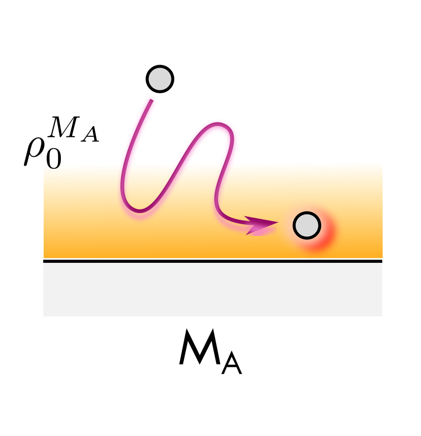

# [Molecular dynamics with electronic friction (MDEF)](@id mdef-dynamics)

## Introduction
 
A set of fundamental and technologically relevant chemical processes (surface scattering, dissociative chemisorption, surface diffusion, recombinative desorption, etc) are often catalyzed at the metal surface of several late transition metals (Au, Ag, Cu, Pt, Pd, Rh, etc). These metallic surfaces, unlike to other kind of surfaces, are characterized by highly dense electronic states landscape which produce a continue conduction and valence bands virtually without any band gap. A proper theoretical description of these chemical processes are often challenging due to the Born-Oppenheimer (BO) approximation is not longer valid and non-adiabatic effects have to be considered to describe the energy exchange that can take place between adsorbate and substrate degrees of freedom (DOF).

A fully quantum dynamic approach of this complex scenario is currently unfeasible and the gas-surfaces reaction dynamics are often approached by quasi-classical methods where the nuclear motion are treated as classical particles but a proper electronic structure description of the metal surface is included through first principle electronic structure calculations in different ways. 

Molecular dynamics with electronic friction (MDEF) is one of main workhorse used to deal with the non-adiabaticity in gas-surfaces chemical reactions and it has been widely employed to decribe and simulate the nuclear dynamics in several molecular systems. MDEF is a theoretical model based on ground-state generalized Langevin equation (GLE) of motion which allow to introduce non-adiabatic effects by means of both friction and stochastic forces. This approach was originally introduced by Head-Gordon and Tully and the non-adiabatic effects can be included through different electronic friction models (see section below, LDFA and TDPT). Within this theoretical framework, the coupling of molecular degree of freedom to electron-hole pair (EHPs) excitations in the metal are described by means of a frictional force  which condense the metal substrate electronic structure into electronic friction object (a tensor or a coefficient). In the context of GLE, the nuclear coordinates of each adsorbate atom evolves as follow, 

```math
   m_{i} \frac{d^{2} \mathbf{r_{i}} }{dt^{2}} = -\frac{\partial V (\{ \mathbf{r_{j}} \}) }{\partial \mathbf{r_{i}}}  -{f_{r,i}^{fric}}  \frac{d \mathbf{r_{i}} }{dt} + \mathbf{{R_{i}}}(t)
```
The first term on the right hand side of the equation (1) corresponds to conservative force associated with potential energy surface (PES) as in the adiabatic case. The second term is the friction force and it come from multiplication between the electronic friction object (``f_{e,i}^{fric}``) and the velocity. This means that the final friction force contribution depends dramatically of both quantities. Finally, the last term is temperature and friction-dependent stochastic random force which assure the detailed balance. For some particular cases, the random force can be neglected setting the electronic temperature at 0 K (see scattering event example below).

This figure shows an atom moving near a metal surface ``M_A``, when the atom moves into the
region of electron density ``\rho_0^{M_A}`` it experiences the forces described above.


### Simple example

We can explore the MDEF concept first by introducing a model system with non-physical
parameters. This will demonstrate the general format and expected results from an MDEF
simulation which can explore further in later sections using realistic systems.

Here we shall model a single hydrogen atom in a harmonic potential,
where the electronic temperature is 300 K.
The friction provided by this model is a random positive definite tensor.
The [`RandomFriction`](@ref RandomFriction) model, similarly to other friction models,
is defined such that it can wrap any given
[`AdiabaticModel`](@ref NonadiabaticModels.AdiabaticModels.AdiabaticModel),
attaching electronic friction to an otherwise adiabatic system.
```@example mdef
using NonadiabaticMolecularDynamics
using Unitful

atoms = Atoms([:H])
model = RandomFriction(Harmonic(dofs=3))
sim = Simulation{MDEF}(atoms, model; temperature=300u"K")
```

For simplicity, we can initialise the system with zero velocity and position for each
degree of freedom:
```@example mdef
z = DynamicsVariables(sim, zeros(size(sim)), zeros(size(sim)))
```

With these parameters, we can run a single trajectory and visualise the total energy as
a function of time.
```@example mdef
using Plots

solution = run_trajectory(z, (0.0, 100u"fs"), sim, dt=0.1u"fs", output=(:hamiltonian))
plot(solution, :hamiltonian)
```

!!! note

    `:hamiltonian` in the output tuple refers to the classical Hamiltonian that
    generates the classical equations of motion. Since we are performing MDEF we
    see that the total energy fluctuates.

Now let's see what happens if we make the electronic temperature a function of time.
For any simulation, temperature can be provided as a time-dependent function which allows
variable temperature simulations.
In the context of MDEF, this can be used to represent the use of lasers to provide
extra energy to the electrons in the metal.

```@example mdef
temperature_function(t) = exp(-(t - 50u"fs")^2 / 20u"fs^2") * 300u"K"
nothing # hide
```

!!! warning

    The time argument enters this function as a `Unitful.jl` quantity, and it
    is important to make sure the unit of the return value is temperature.

Now we can re-simulate, replacing the fixed temperature with the function we have defined.

```@example mdef
sim = Simulation{MDEF}(atoms, model; temperature=temperature_function)
solution = run_trajectory(z, (0.0, 100u"fs"), sim, dt=0.1u"fs",
    output=(:hamiltonian, :position, :velocity))
plot(solution, :hamiltonian)
```

This time we see a peak in the energy in the middle of the simulation which coincides
with the peak in temperature at 50 fs.
Having viewed this simple example, we can now explore the different ways the friction
coefficient can be obtained from ab-initio simulations. 

## Local density friction approximation (LDFA)

Local density friction approximation (LDFA) is a theoretical model which describes the electronic friction ``(f_{e,i}^{fric})`` term in the above equation based on the electron density of the metal substrate. This approximation assumes a single friction coefficient (``\eta_{e,i}``) for each adsorbate atom assuming a anisotropic contribution. In the LDFA theoretical framework the above equation read as

```math
   m_{i} \frac{d^{2} \mathbf{r_{i}} }{dt^{2}} = -\frac{\partial V (\{ \mathbf{r_{j}} \})}{\partial \mathbf{r_{i}}}   -\eta_{e,i}(\mathbf{r_{i}})  \frac{d \mathbf{r_{i}} }{dt} + \mathbf{{R_{i}}}(t)
```

In our current LDFA implementation, a set of pre-calculated electronic friction coefficients (``\eta_{e,i}``) computed at different Wigner-Seitz radius (``r_s``) are used to fit and get an analytical expression to connect any ``r_s`` values with an single electronic friction coefficient by means of   
cubic Spline functions. The Wigner-Sietz radius is connected with the metal substrate electron density by the following equation, 

```math
   r_s(\rho) = (\frac{3}{4\pi \rho (\mathbf{r_{i}})})^{1/3}
```

In this way, the electron density associated with the current substrate atom position is used to compute the respective friction coefficient through fitting function for each point of the trajectory.
Visit the [CubeLDFAModel.jl](@ref models-cubeldfa) to learn more about how this is evaluated.

## Time-dependent Perturbation theory (TDPT)

A more general formulation of the electronic friction object was also developed under the umbrella of electronic friction tensor(EFT) or orbital-dependent electronic friction (ODF) approaches. Both formulations are essentially equivalent and they incorporate the anisotropy nature of the electronic friction object by a multidimentional tensor (``\Lambda_{ij}``) instead of a single coefficient as usually computed at LDFA level.  The electronic friction elements can be computed by first-principle calculations in the context of first-order time-dependent perturbation theory (TDPT) at the density functional theory (DFT) level. In the context of this approach the GLE read as, 

```math
   m_{i} \frac{d^{2} \mathbf{r_{i}} }{dt^{2}} = -\frac{\partial V (\{ \mathbf{r_{j}} \}) }{\partial \mathbf{r_{i}}}   -\sum_{j} \Lambda_{ij}  \frac{d \mathbf{r_{i}} }{dt} + \mathbf{{R_{i}}}(t)
```

Each electronic friction tensor (EFT) elements corresponds to relaxation rate due to electron-nuclear coupling along the Cartesian coordinate ``i`` due to motion in the ``j`` direction. The electronic friction tensor elements can be computed by using the Fermi's golden rule.

Here, ``\vert \psi_{k\nu} \rangle`` and ``\epsilon_{k\nu}`` are the Kohn-Sham (KS) ground state eigenstates and eigenenergies, respectively. The derivatives quantities are computed by finite difference numerically and normalized Gaussian distribution of finite width (``\sigma``) centered at Fermi level is used to facilitate convergence instead to the ``\delta`` function. A ``\delta`` value of 0.6 is often selected to due is able to produce converged results in the majority of the systems analyzed.

``\Lambda_{ij}`` is object with (``3N\times3N``)-dimension where N is often the total number of adsorbate atoms considered explicitly on the study system.
View the [friction models page](@ref models-friction) to learn about how this can be used.

!!! tip "TDPT friction and LDFA in action?"

    If you would like to see an example using both LDFA and TDPT during full dimensional
    dynamics, refer to the [reactive scattering example](@ref ).
