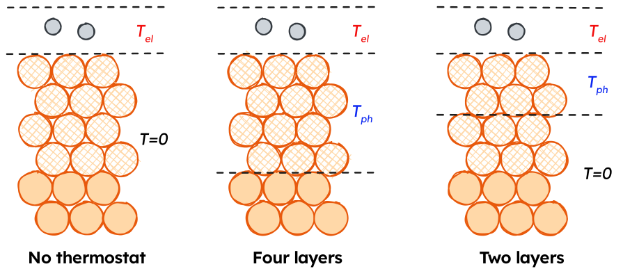

```@setup logging
@info "Expanding src/dynamicssimulations/dynamicsmethods/mdef.md..."
start_time = time()
```
# [MDEF with the Two-temperature model and separate Electron and Phonon Thermostats](@id mdef-ttm-example)

!!! note

	This page focuses on using the model combination tools in NQCDynamics.jl and NQCModels.jl to perform MDEF simulations with separate thermostats for different parts of the system. 
	The page on [Molecular Dynamics with Electronic Friction](@ref mdef-dynamics) contains more information on MDEF as a method, and is a better starting point to setting up simulations. 

## Intro🦆tion
On this page, we will look at the example of simulating the response of hydrogen adsorbed to a Cu(111) surface to an ultrafast laser pulse using [Molecular Dynamics with Electronic Friction](@ref mdef-dynamics) and the Two-temperature model.

As detailed before, the nuclear coordinates in MDEF evolve as follows:
```math
\mathbf{M}\ddot{\mathbf{R}} = - \nabla_R V(\mathbf{R}) + \mathbf{F}(t) - \Gamma(\mathbf{R}) \dot{\mathbf{R}}
```
The first term on the right hand side of the equation corresponds to a conservative force associated with the potential energy surface (PES) as in the adiabatic case. The third term is the friction force and it comes from multiplication between the electronic friction object (``\Gamma(\mathbf{R})``) and the velocity.
Finally, the second term is a temperature and friction-dependent stochastic force which ensures detailed balance.

## The two-temperature model

!!! info

	Temperature profiles for the Two-temperature model can be generated using the [LightMatter.jl](https://github.com/maurergroup/LightMatter.jl) package. (Will be released soon)


The two-temperature model (TTM) is a system of two coupled differential equations that describe the time evolution of the electronic and lattice temperatures, $T_{el}$ and $T_{ph}$. In this work, lateral heat transport across the metal surface is neglected, allowing for a simplified one-dimensional representation of the two-temperature model. The TTM is given by the following set of equations: 

**Electronic heat capacity**
```math 
C_{el}\frac{\partial}{\partial t}T_{el}=\nabla(\kappa\nabla T_{el})-g(T_{el}-T_{ph})+S(z,t) 
```

**Phononic heat capacity**
```math
C_{ph}\frac{\partial}{\partial t}T_{ph}=g(T_{el}-T_{ph}) 
```

**Laser source term**
```math
S(z,t)=F\cdot\frac{\exp{\frac{-z}{\xi}}\cdot\exp{\frac{-(t-t_0)^2}{2r^2}}}{\xi\cdot\sqrt{2\pi}\tau}; 
		\tau=\frac{\mathrm{FWHM}}{2\sqrt{2\ln{2}}}
```

The model is parametrised with material-specific parameters obtained from ab-initio calculations or experiments. As an example, the material-specific parameters for bulk crystalline Cu are shown here ([Scholz2019](@cite)):

| Parameter				| Explanation													| Value											|
|-----------------------|---------------------------------------------------------------|-----------------------------------------------|
| ``g``					| Electron-phonon coupling constant								| ``1\times 10^{-17}~\mathrm{W~m^{-3}~K^{-1}}``	|
| ``\xi``				| Laser penetration depth for ``\lambda=400~\mathrm{nm}``		| ``\frac{1}{\xi}=14.9~\mathrm{nm}``			|
| ``\gamma_{el}``		| Scaling constant for the electronic heat capacity ``C_{el}``.	| ``98.0~\mathrm{J~m^{-3}~K^{-2}}``				|
| ``\theta_D``			| Debye temperature of Cu.										| ``343~\mathrm{K}``							|
| ``N``					| Atom density of bulk Cu										| ``8.5\times 10^{28}``							|
| ``\kappa_{RT}``		| Thermal conductivity at room temperature						| ``401.0~\mathrm{W^{-1}~K^{-1}}``				|
| ``\mathrm{FWHM}``		| Full width half maximum of the laser pulse					| ``150~\mathrm{fs}``							|


The electronic heat capacity $C_{el}(T_{el})$ was determined using a linear scaling relation:

```math
C_{el}(T_{el})=\gamma_{el}T_{el} 
```

The temperature dependence of the thermal conductivity of Cu was modelled using the following relation:

```math
\kappa(T_{el}, T_{ph})=\kappa_{RT}\frac{T_{el}}{T_{ph}}
```

The phononic heat capacity was calculated using the Debye model with $N$ and $\theta_D$ values given above:

```math
C_{ph}(T_{ph})=9nk_B\left(\frac{T_{ph}}{\theta_D}\right)^3\int_0^{\frac{\theta_D}{T_{ph}}}\frac{x^4e^x}{(e^x-1)^2}~dx
```


An example of the TTM progression for a $80~\mathrm{J~m^{-2}}$ absorbed fluence is shown in the video below. 


In our implementation of the TTM, the temperature progressions are saved to CSV files, which need to be interpolated to provide a continuous temperature function to use for our `Simulation`s. 

```julia
using BSplineKit
using Unitful, UnitfulAtomic
using CSV, DataFrames

"""
This function reads a CSV file for a TTM solution containing:
1. The time in ps
2. Electronic temperature
3. Phononic temperature

Depending on which index is specified, a continuous temperature function for the electronic or phononic temperature is returned. 
"""
function T_function_from_file(file::String, index::Int=2)
	TTM_file = CSV.read(file, DataFrame)
	T_spline = interpolate(TTM_file.Time, TTM_file[:, index], BSplineOrder(4)) # is a cubic spline
	T_extrapolation = extrapolate(T_spline, Smooth()) #! Don't use to go earlier than the first point!
	T_function(time_ps) = T_extrapolation(ustrip(u"ps", time_ps)) * u"K"
	return T_function
end

T_el_function = T_function_from_file("ttm-file.csv", 2)
T_ph_function = T_function_from_file("ttm-file.csv", 3)
```

## Combining MDEF and the TTM
The electron and phonon temperatures are propagated as described above, yielding temperature profiles that are applied to MDEF simulations through the ``\mathcal{W}`` term in the Langevin equation.
``T_{el}`` is applied directly to the adsorbate H atoms, while ``\gamma`` as a function of H positions is determined using one of the MLIPs detailed above. 
``T_{ph}`` is coupled to the surface Cu atoms using a position-independent coupling constant.



As shown above, ``T_{ph}`` can enter our system in different ways. We will use [`Subsystem`](@ref)s to generate a [`CompositeModel`](@ref) and [`Simulation`](@ref) for these different strategies. 

```julia
using NQCDynamics
using Unitful, UnitfulAtomic
using MACEModels

# Import starting structure
atoms, position, cell = read_extxyz("starting_structure.xyz")

# Load PES model
pes_model = MACEModel(
	atoms,
	cell,
	["mace-model.model"];
	device="cpu",
	default_dtype=Float32,
	mobile_atoms::Vector{Int}=18:56, # Keep the top 4 layers mobile, freeze the bottom 2. 
)

# Load adsorbate and surface friction models
adsorbate_friction_model = RandomFriction(3)
surface_friction_model = ConstantFriction(γ=0.2)
```

Now that all models are defined, we can combine them in different ways for a simulation:

### Electron thermostat only

```julia
# PES applies to all atoms
pes_subsystem = Subsystem(pes_model)

# Electronic friction applies to adsorbate atoms 55,56
electronic_friction = Subsystem(adsorbate_friction_model, indices=[55,56])

# Combine models and generate Simulation
combined_model = CompositeModel(pes_subsystem, electronic_friction)

sim_T_el_only = Simulation{MDEF}(
	atoms, 
	combined_model; 
	temperature = T_el_function, 
	cell=cell
)
```

### Phonon thermostatting top four layers
```julia
# PES applies to all atoms
pes_subsystem = Subsystem(pes_model)

# Electronic friction applies to adsorbate atoms 55,56
electronic_friction = Subsystem(adsorbate_friction_model, indices=[55,56])

# Phononic friction applies to surface atoms 18:54
phononic_friction = Subsystem(surface_friction_model, indices=18:54)

# Combine models and generate Simulation
combined_model = CompositeModel(
	pes_subsystem, 
	electronic_friction, 
	phononic_friction
)

# Create Temperature objects to apply T_el to adsorbates, T_ph to surface
# Manually specified indices
electron_thermostat = Temperature(T_el_function, indices = [55,56]) 
# Inherit indices from a Subsystem
phonon_thermostat = Temperature(T_ph_function, phononic_friction) 

sim_T_el_only = Simulation{MDEF}(
	atoms, 
	combined_model; 
	temperature = [
		electron_thermostat,
		phonon_thermostat
	], 
	cell=cell
)
```
