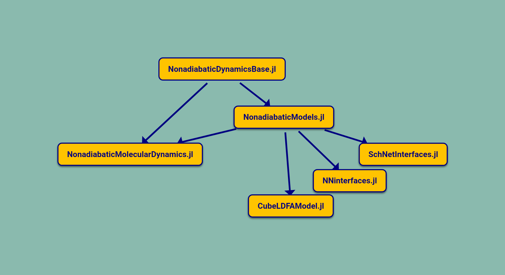

# Introduction

Welcome to the documentation for NonadiabaticMolecularDynamics, 
a package for performing nonadiabatic molecular dynamics simulations.
The documentation covers both how to use the existing code and describes the
intricacies of the implementations, hoping to make further contributions as simple as possible.

### Objectives

- Achieve high performance along with good readability, extensibility, maintainability
- Provide for both simple models and high-dimensional systems
- Highlight the advantages of Julia in the field of nonadiabatic dynamics
- Encourage code sharing and reuse within the nonadiabatic dynamics community

Often research papers present dynamics methods and apply them
to small model systems without providing the reader with the code used to obtain the results.
This can lead to difficulties when attempting to reproduce the results or better understand
the theory and implementation of the method.
This project provides implementations for existing dynamics methods along with
a framework that can be used for future research with the goal of encouraging greater
code sharing and reuse within the nonadiabatic dynamics community.

### Features

Here we have a list of the currently implemented features that the code provides.
If you are interested in contributing further methods, please open up an
issue/pull request on Github!

#### Dynamics methods

- [Classical molecular dynamics](@ref)
- [Classical Langevin dynamics](@ref)
- [Fewest-switches surface hopping (FSSH)](@ref)
- [Molecular dynamics with electronic friction (MDEF)](@ref)
- [Ring polymer molecular dynamics (RPMD)](@ref)
- [Nonadiabatic ring polymer molecular dynamics (NRPMD)](@ref)
- [Ring polymer surface hopping (RPSH)](@ref)
- [Ehrenfest molecular dynamics](@ref)

#### Generating initial conditions

- [Thermal Metropolis-Hastings Monte Carlo](@ref)
- [Thermal Hamiltonian Monte Carlo](@ref)
- [Langevin dynamics](@ref)
- [Semiclassical EBK quantisation](@ref)

### Dynamics with `DifferentialEquations.jl`

The [`DifferentialEquations`](https://diffeq.sciml.ai/stable/) ecosystem from the
[SciML organisation](https://github.com/SciML/) provides a large library of integration
algorithms along with a simple interface for implementing new algorithms that can be tailored
for specific nonadiabatic dynamics methods.
Further, they provide helpful utilities for introducing discontinuities through the 
[callback interface](https://diffeq.sciml.ai/stable/features/callback_functions/#Using-Callbacks)
or handling many trajectories at once to obtain ensemble averaged observables with
the [ensemble interface](https://diffeq.sciml.ai/stable/features/ensemble/).
We can take advantage of these utilities by basing our dynamics setup on this framework
which significantly simplifies the implementation of new methods.

### Installation

#### 1. Install Julia
Download and install the current stable release from the [Julia website](https://julialang.org/downloads/).
For most platforms `julia` is provided as a precompiled binary.

#### 2. Install the `NQCDRegistry`
Since the package is not included in the default registry (`General`), we must first
install the `NQCDRegistry`.
This gives access to the core `NonadiabaticMolecularDynamics` package along with some dependencies
and add-ons.
First, enter the Julia REPL by executing `julia` from the command line.
Then press `]` to enter `pkg` mode. The prompt should change from `julia>` to `pkg>`.
Install the registry directly from Github with: 
```julia-repl
pkg> registry add "https://github.com/NQCD/NQCDRegistry"
```

#### 3. Install the package
Now that the registry has been added, the package can be installed in the same way as any other registered Julia package:
```julia-repl
pkg> add NonadiabaticMolecularDynamics
```

#### 4. Use the package!
```julia-repl
julia> using NonadiabaticMolecularDynamics
```

To check the package has been installed correctly and everything is working, you can execute the tests
with:
```julia-repl
pkg> test NonadiabaticMolecularDynamics
```
Alternatively, you can proceed directly the next section for a walkthrough of some basic functionality.

### How to use this documentation

The first page to read is the [Getting started](@ref) section which walks through all the ingredients
needed to perform a simple classical dynamics simulation.
After this, the reader is free to explore at their leisure since everything else builds directly
upon sections from the [Getting started](@ref) page.

### Package ecosystem

Included in the `NQCDRegistry` alongside the main package are a few others that provide extra
models and add-ons. Here is an overview of the currently existing packages included in
the registry:

```@raw html

```
