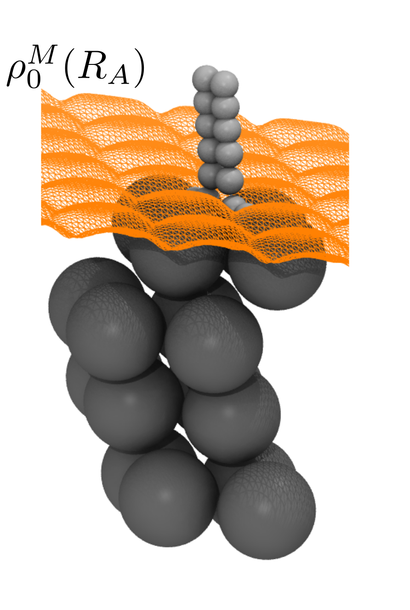

# Local density friction approximation (LDFA)

During dynamics of molecules interacting with metals, low energy electron-hole pair
excitations can lead to a breakdown of the Born-Oppenheimer (BO) approximation.
Molecular dynamics with electronic friction (MDEF) has been proposed as a correction to
BO dynamics, where a Langevin equation is used to model the dynamics of the molecule
within the metal electron density.

```@raw html

```
```@raw html

```

The LDFA provides a simple way to relate the electron density to a friction coefficient
that can be used to propagate the dynamics.

Here, LDFA is implemented using the LDA data provided by Gerrits et al. in
[Phys. Rev. B 102, 155130](https://doi.org/10.1103/PhysRevB.102.155130).
This data provides the friction coefficient evaluated at a few discrete values of
the Wigner-Seitz radius ``r_s ^{-3} = \frac{4}{3} \pi n_0``.
A cubic spline interpolation is performed which provides a continuous function
for the friction coefficient. 

```@raw html

```

Currently provided is the `CubeLDFAModel` which attaches LDFA friction to an existing
model, where the density is obtained from a cube file.
```@docs 
CubeLDFAModel.LDFAModel
```
Further models could be added that obtain the density from other sources, such as from
a machine-learning model.
