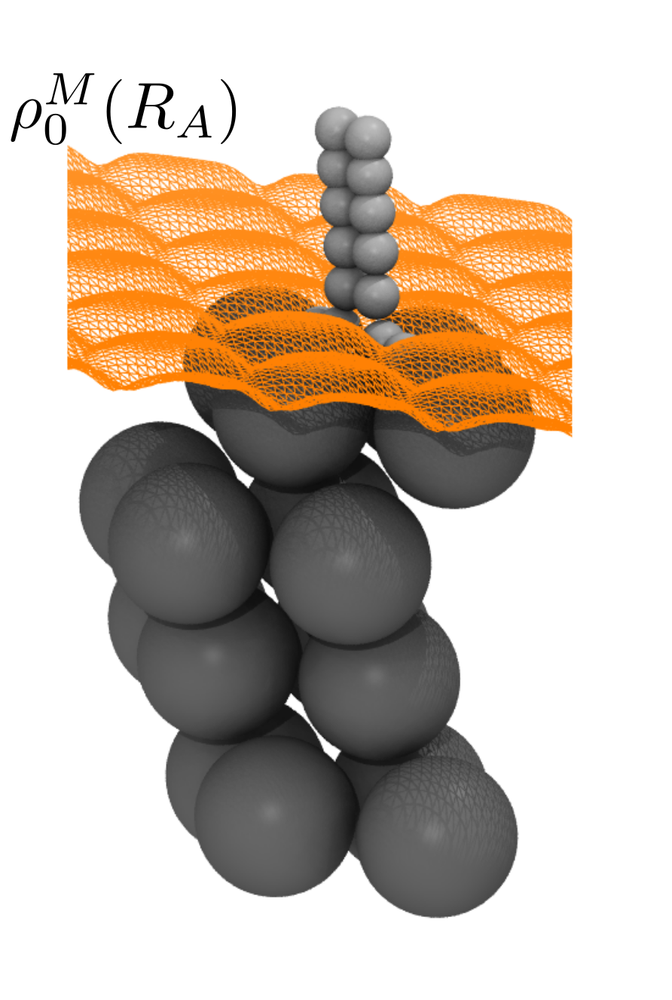

# Local density friction approximation (LDFA)

During dynamics of molecules interacting with metals, interaction of nuclear motion with
electron-hole pairs can occur and leading to a breakdown of the Born-Oppenheimer (BO) approximation.
Molecular dynamics with electronic friction (MDEF) has been proposed as a correction to
BO dynamics for cases where low-energy electron hole pairs are excited. In MDEF, the Langevin 
equation is used to model the dynamics of the molecule within the metal electron density.

The local density friction approximation (LDFA) obtains the friction coefficient within the 
Langevin equation from the local electron density.

Here, LDFA is implemented using the LDA data provided by Gerrits et al. in
[Phys. Rev. B 102, 155130 (2020)](https://doi.org/10.1103/PhysRevB.102.155130).
This data provides the friction coefficient evaluated at a few discrete values of
the Wigner-Seitz radius ``r_s ^{-3} = \frac{4}{3} \pi n_0``.
A cubic spline interpolation is performed which provides a continuous function
for the friction coefficient. 

Currently provided is the [`LDFAModel`](@ref CubeLDFAModel.LDFAModel)
which attaches LDFA friction to an existing model, where the density is obtained from a cube file.
Further models could be added that obtain the density from other sources, such as from
a machine-learning model.
